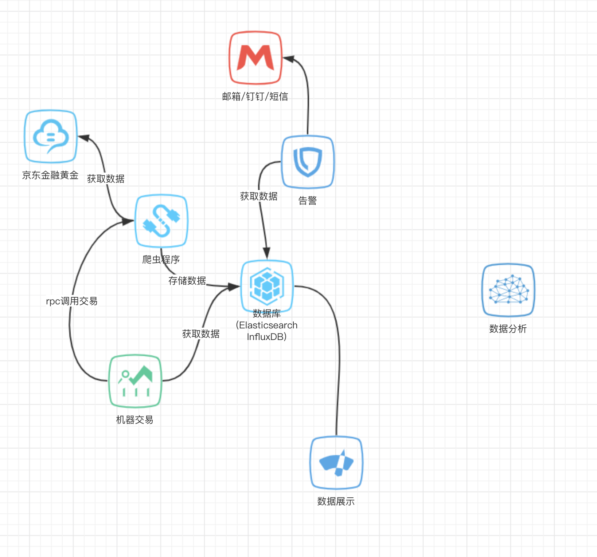

# cockchafer
# 需求

### v1

1. 挖掘京东黄金实时数据。
2. 分析每天最高峰，最低峰，平均价。
3. 以图形方式展示。
4. 阈值报警。

### v2
1. 实现自动买入卖出。
2. 分析历史数据动态实现低买高卖。

# 实现

### v1
- 以Python为基础实时爬取京东黄金数据
- 存储数据(Elasticsearch InfluxDB)
- 阈值通过短信钉钉及时报警
- 数据展示(DataV数据可视化)

### v2
- 实时计算(spark flink DataWorks)
- Ai动态分析学习(Tensorflow 机器学习PAI)
- 买入卖出

# 模块划分
服务名称 | 功能 | 语言/实现
--- | --- | ---
DataCollect | 数据抓取 | Python
MessageWarning | 告警 | Java
IntelligenceCenter | 智能算法 | Tensorflow/Flink/机器学习PAI
RobotTrading | 机器交易 | Java/其他
DataChart | 图表 | dataV/其他

# 模型图
